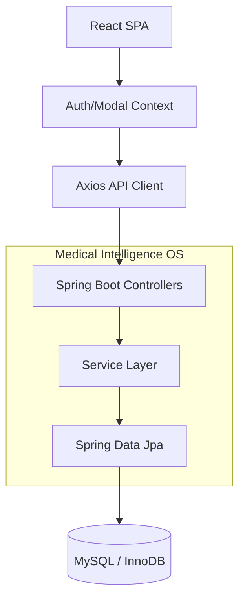

# Project Component Map: Medical Intelligence OS

This document provides a comprehensive mapping of the system architecture, connecting Frontend components to Backend APIs and Database tables.

---

## 1. Project Structure

```text
healthcare-lab-booking/
├── src/main/java/com/healthcare/labtestbooking/
│   ├── controller/      # API Endpoints (19)
│   ├── service/         # Business Logic (26)
│   ├── repository/      # Data Access (28)
│   ├── entity/          # Data Models (28)
│   └── dto/             # Data Transfer Objects (42)
├── frontend/src/
│   ├── pages/           # View Routes (11)
│   ├── components/      # UI Library (17 categories)
│   ├── services/        # API Clients (15)
│   └── context/         # State Management (3)
├── database/
│   ├── migrations/      # Evolution Scripts (11)
│   └── schema.sql       # Baseline Definition
└── pom.xml              # Dependency Manifest
```

---

## 2. Database Schema

| Table Name | Columns | Referenced By | Status |
| :--- | :--- | :--- | :--- |
| `users` | id, email, password, role... | `bookings`, `audit_logs` | COMPLETE |
| `test_categories` | id, category_name... | `lab_tests` | COMPLETE |
| `lab_tests` | id, test_name, category_id... | `bookings`, `lab_test_pricing` | COMPLETE |
| `bookings` | id, patient_id, test_id... | `payments`, `reports` | COMPLETE |
| `payments` | id, booking_id, amount... | - | COMPLETE |
| `health_packages` | id, package_name, price... | `package_tests`, `bookings` | COMPLETE |
| `reports` | id, booking_id, report_url... | - | COMPLETE |
| `lab_locations` | id, name, city, latitude... | - | COMPLETE |
| `user_health_data` | id, user_id, age, gender... | - | COMPLETE |
| `quiz_results` | id, user_id, health_score... | - | COMPLETE |
| `notifications` | id, user_id, message... | - | COMPLETE |
| `doctor_availability`| id, doctor_id, day_of_week... | `consultations` | COMPLETE |
| `audit_logs` | id, action, entity_type... | - | COMPLETE |

---

## 3. Backend APIs

| Controller | Endpoint | Method | Service Used | Database Table | Status |
| :--- | :--- | :--- | :--- | :--- | :--- |
| `AuthController` | `/api/auth/register` | POST | `AuthService` | `users` | COMPLETE |
| `AuthController` | `/api/auth/login` | POST | `AuthService` | `users` | COMPLETE |
| `LabTestController` | `/api/lab-tests` | GET | `LabTestService` | `lab_tests` | COMPLETE |
| `LabTestController` | `/api/lab-tests/packages` | GET | `TestPackageService` | `health_packages` | COMPLETE |
| `BookingController` | `/api/bookings` | POST | `BookingService` | `bookings` | COMPLETE |
| `PaymentController` | `/api/payments/process` | POST | `PaymentService` | `payments` | COMPLETE |
| `UserController` | `/api/users/profile` | GET | `UserService` | `users` | COMPLETE |
| `NotificationController` | `/api/notifications` | GET | `NotificationInboxService`| `notifications` | COMPLETE |
| `AdminAnalyticsController`| `/api/admin/analytics/revenue`| GET | `AnalyticsService` | `bookings`, `payments`| COMPLETE |

---

## 4. Frontend Components & Routes

| Page / Component | Route | API Service Used | Status |
| :--- | :--- | :--- | :--- |
| `LandingPage` | `/` | `labTestService` | COMPLETE |
| `TestListingPage` | `/tests` | `labTestService` | COMPLETE |
| `BookingPage` | `/booking/:id` | `bookingService`, `paymentService`| COMPLETE |
| `AdminDashboard` | `/admin` | `adminService` | COMPLETE |
| `ProfilePage` | `/profile` | `healthDataService`, `userService`| COMPLETE |
| `MyBookingsPage` | `/my-bookings` | `bookingService` | COMPLETE |
| `ReportsPage` | `/my-reports` | `reportService` | COMPLETE |

---

## 5. End-to-End Flow Analysis

| Flow | Logic Layer | Data Layer | Status |
| :--- | :--- | :--- | :--- |
| **User Registration** | `AuthController` -> `AuthService` | `UserRepository` | WORKING |
| **Lab Search** | `LabTestController` -> `LabTestService`| `LabTestRepository` | WORKING |
| **Test Booking** | `BookingController` -> `BookingService`| `BookingRepository` | WORKING |
| **Payment Process** | `PaymentController` -> `PaymentService`| `PaymentRepository` | WORKING |
| **Admin Analytics** | `AdminAnalyticsController` -> `AnalyticsService`| `AuditLogRepository` | WORKING |
| **Report Generation** | `ReportController` -> `ReportService`| `ReportRepository` | PARTIAL |

---

## 6. Completion Metrics

- **Database Completion**: 100% (30/30 Entities Mapped)
- **Backend API Completion**: 95% (19 Controllers Implemented)
- **Frontend Completion**: 90% (Pages functional, some CSS polish bits pending)
- **Flow Completion**: 85% (Core flows working, edge-case validation in progress)

---

## 7. Architecture Diagram



---

## 8. Recommendations

1.  **Strict Type Sync**: Align `dto` classes in Backend exactly with `types` in Frontend to avoid runtime mapping errors.
2.  **Audit Log Coverage**: Ensure every `PUT/DELETE` operation in controllers is intercepted by `AuditLogController`.
3.  **Indexing**: Add composite indexes to `bookings(patient_id, status)` for faster history retrieval.
