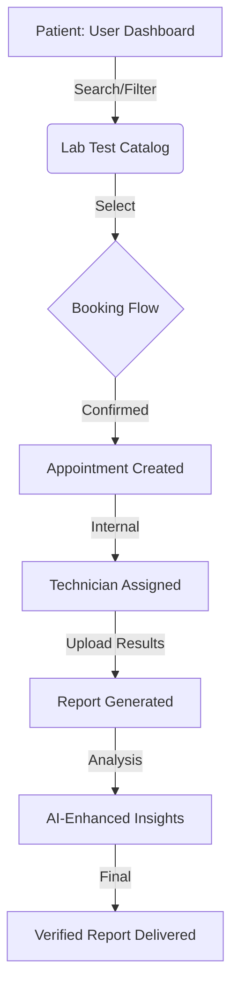

# 🏛️ System Architecture

> **The high-performance, scalable backbone of the Healthcare Lab Ecosystem.**

---

## 🏗️ Core Architecture Overview

Healthcare Lab is structured as a modern **Decoupled Full-Stack Application**, utilizing a high-efficiency Java Spring Boot backend and a lightning-fast React + Vite frontend. The system is designed to handle thousands of concurrent bookings and millions of test records with sub-second response times.

---

## 🛠️ Technology Pillar

### 🍃 Backend (The Engine)
- **Framework:** Spring Boot 3.3.x
- **Persistence:** Hibernate / Spring Data JPA
- **Security:** JWT (Stateless) with Spring Security
- **Data Integrity:** Intelligent database seeding and role-based access control (RBAC).

### ⚛️ Frontend (The Experience)
- **Platform:** React 19 + Vite
- **Styling:** Tailwind CSS v4 (Glassmorphism & Fluid UI)
- **Animation:** Framer Motion (Smooth Transitions)
- **Virtualization:** React Window (For smooth 1000+ list scrolling)

### 🗄️ Database (The Memory)
- **Engine:** MySQL 8.0 / PostgreSQL
- **Caching:** Redis (Optional integration for session/result caching)

---

## 🔄 Lifecycle of a Lab Test

---

## 🔒 Security Posture

1. **End-to-End Encryption:** All data in transit is secured via TLS.
2. **JWT-Based Identity:** Stateless authentication ensures maximum scalability across cloud environments.
3. **Audit Logging:** Every critical transaction (Booking, Report Submission) is tracked via a dedicated `AuditListener`.
4. **Role Isolation:**
   - **PATIENT:** Booking and report access only.
   - **TECHNICIAN:** Data entry and collection management.
   - **MEDICAL OFFICER:** Result verification and clinical oversight.
   - **ADMIN:** Full system control and infrastructure scaling.

---

## 📈 Scalability Design

- **Optimized Queries:** Leverages `@Cacheable` and specific JPQL optimization to avoid N+1 query problems.
- **Frontend Virtualization:** The lab test list uses virtualization to ensure that rendering 1000+ tests does not impact browser performance.
- **Microservice Ready:** The backend is modularly structured to be easily transitioned into microservices (Booking Service, User Service, Catalog Service).

---

## 👨‍💻 Strategic Oversight
- **Chief Architect:** AMANJEET KUMAR
- **Mission:** High availability, zero latency, and beautiful healthcare logic.

---

  <i>"Architecture is the foundation of trust in healthcare software."</i>

